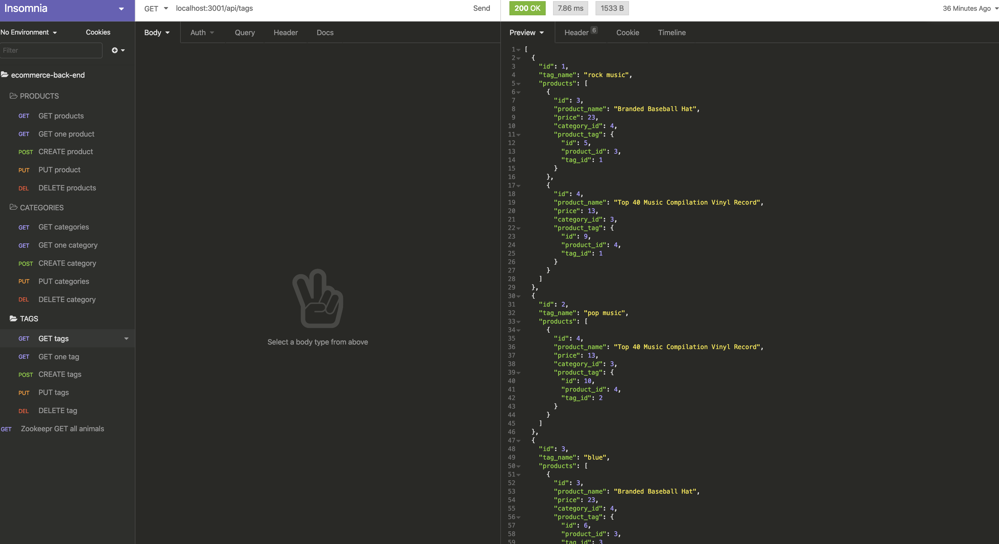

**Internet Retail**

  ## **Description**
  * This is a back end application for an e-commerce website that uses the latest technologies that allows the company to compete with other e-commerce           comapnies. 
   
  ## **Table of Contents**
  ### [Installation](#Installation)
  ### [Usage](#Usage) 
  ### [Contributing](#contributing)
    
  ## Installation
  * npm init --y
  * npm install dotenv
  * npm i sequelize
  * npm install --save mysql2
  
  
  ## Usage
 

  ## **License:**
  This project is protected under the MIT license.

  ## Contributing
  * npm express package
  * npm uuid package
  
  ## **Questions**
  * Visit me at [gitHub](http://www.github.com/ryannekillian)
  * For additional questions, please reach me at: ryanne.killian@gmail.com
